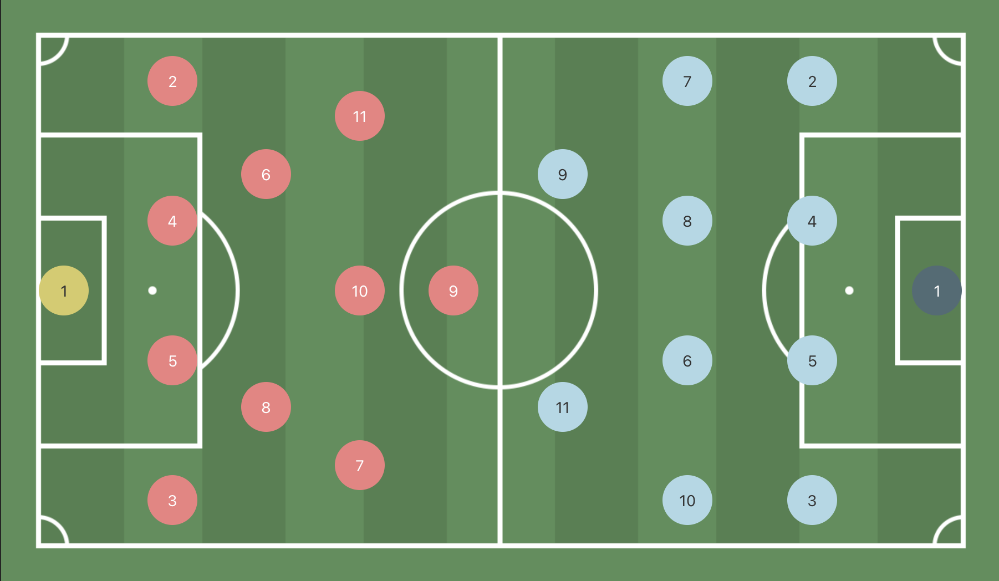
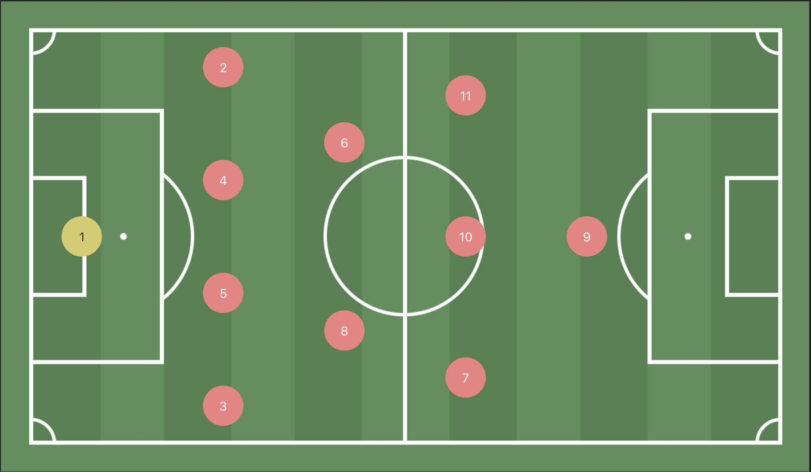

# @chris-baur/react-soccer-lineup

⚽ React Soccer Lineup — A responsive, customizable soccer pitch layout for React apps ⚛️  
Modernized fork of [react-soccer-lineup](https://github.com/giustini/react-soccer-lineup), updated for React 19+, auto-injected CSS, and better DX.

[](https://www.npmjs.com/package/@chris-baur/react-soccer-lineup)  
[](https://standardjs.com)

# Default view with no teams

# Both teams

# Only Home team

---

## 🚀 Install

```bash
npm install @chris-baur/react-soccer-lineup
```
✅ No need to import any CSS — styling is auto-injected.

## ⚡ Usage

```javascript
import React from 'react';
import SoccerLineUp from '@chris-baur/react-soccer-lineup';

export default function Example() {
  return (
    <SoccerLineUp
      size="normal"
      color="#588f58"
      pattern="lines"
      homeTeam={{
        squad: {
          gk: { number: 1 },
          df: [{ number: 2 }, { number: 3 }, { number: 4 }, { number: 5 }],
          cm: [{ number: 6 }, { number: 8 }],
          cam: [{ number: 7 }, { number: 10 }, { number: 11 }],
          fw: [{ number: 9 }],
        },
        style: {
          color: '#f08080',
          numberColor: '#ffffff',
        },
      }}
    />
  );
}

```
## 🎨 Props

| Prop       | Type     | Required | Default    | Description                                            |
| ---------- | -------- | -------- | ---------- | ------------------------------------------------------ |
| `color`    | `string` | No       | `#588f58`  | Pitch background color                                 |
| `size`     | `string` | No       | `"normal"` | One of: `small`, `normal`, `big`, `responsive`, `fill` |
| `pattern`  | `string` | No       | -          | Pitch grass pattern: `lines`, `squares`, `circles`     |
| `homeTeam` | `Team`   | No       | -          | Team displayed on the left                             |
| `awayTeam` | `Team`   | No       | -          | Team displayed on the right                            |

## 🧩 Team Format
```javascript
type Team = {
  squad: {
    gk?: Player;
    df?: Player[];
    cdm?: Player[];
    cm?: Player[];
    cam?: Player[];
    fw?: Player[];
  };
  style?: {
    color: string;
    numberColor: string;
    nameColor?: string;
  };
};

type Player = {
  name?: string;
  number?: number;
  color?: string;
  numberColor?: string;
  nameColor?: string;
  onClick?: () => void;
};
```

## ✅ Features
* ⚙️ Fully customizable formations

* 🎨 Player and team color control

* 🧠 Clickable players (with onClick)

* 📱 Responsive layout support

* 🧼 No external CSS import required

# [🧪 Live Demo](https://codesandbox.io/p/sandbox/cs8r5g)


## 📦 Differences from original
* 🧩 TypeScript & type exports

* 💅 SCSS auto-injected (no need to import .css)

* 🧱 Rollup 4 & React 19 compatible

* 📦 Scoped under @chris-baur namespace


📄 License MIT © 

Forked and modernized by [@chris-baur](https://github.com/chris-baur), originally by [@giustini](https://github.com/giustini)
