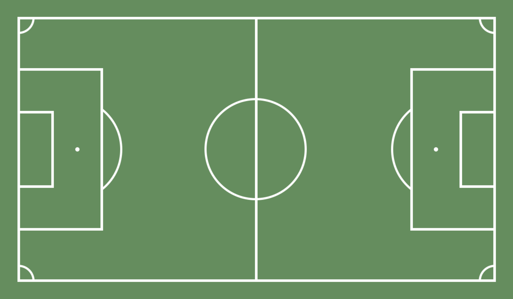
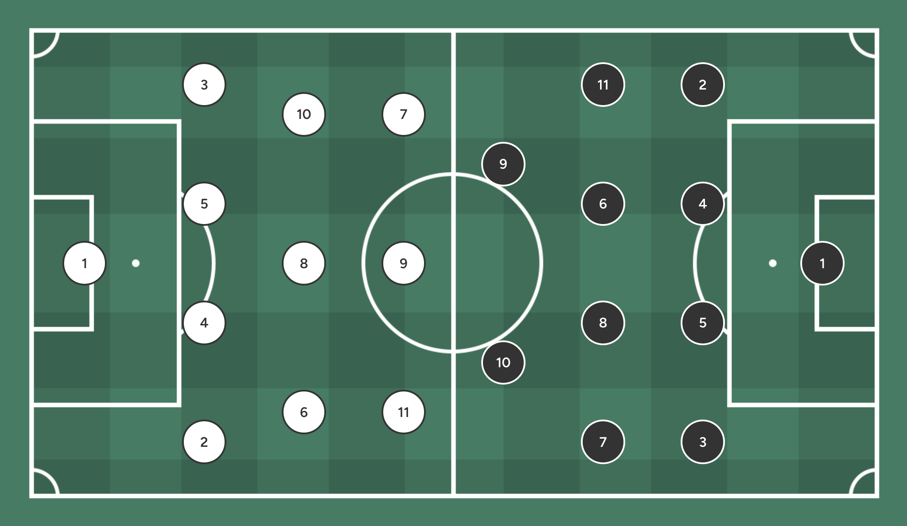

<div align="center">
    
</div>

<div align="center">
    <h3>React Soccer Lineup </h3>
    <p>⚽ A soccer pitch representation component for React ⚛️</p>
</div>

<div align="center">

[](https://www.npmjs.com/package/react-soccer-lineup) [](https://standardjs.com) [](https://www.npmjs.com/package/react-soccer-lineup)

</div>

## Install

```bash
npm install react-soccer-lineup
```

## Basic usage

```tsx
import SoccerLineUp from 'react-soccer-lineup';

function App () {
    return <SoccerLineUp />;
}
```



## Render teams

```tsx
import SoccerLineUp, { type Team } from 'react-soccer-lineup';

function App () {
    const homeTeam: Team = {
      squad: {
        gk: { number: 1 },
        df: [{ number: 2 }, { number: 4 }, { number: 5 }, { number: 3 }],
        cm: [{ number: 11 }, { number: 6 }, { number: 8 }, { number: 7 }],
        fw: [{ number: 9 }, { number: 10 }]
      },
      style: {
        borderColor: '#333333'
      }
    };
    
    const awayTeam: Team = {
      squad: {
        gk: { number: 1 },
        df: [{ number: 2 }, { number: 4 }, { number: 5 }, { number: 3 }],
        cm: [{ number: 6 }, { number: 8 }, { number: 10 }],
        fw: [{ number: 11 }, { number: 9 }, { number: 7 }]
      },
      style: {
        borderColor: '#ffffff'
      }
    };
    
    return (
        <SoccerLineUp
          size='responsive'
          color='#327D61'
          pattern='squares'
          homeTeam={homeTeam}
          awayTeam={awayTeam}
        />
    );
}
```




## API

| Prop       | Type     | Required | Default value                                                      | Description                                                                             |
|------------|----------|----------|--------------------------------------------------------------------|-----------------------------------------------------------------------------------------|
| `color`    | `string` | No       |  `#588f58` | The pitch background color                                                              |
| `size`     | `string` | No       | `"normal"`                                                         | Pitch dimensions. Supported values: `small`, `normal`, `big`, `responsive`, `fill`      |
| `pattern`  | `string` | No       | -                                                                  | The pattern applied to the pitch grass. Supported values: `lines`, `squares`, `circles` |
| `homeTeam` | `Team`   | No       | -                                                                  | The left side team                                                                      |
| `awayTeam` | `Team`   | No       | -                                                                  | The right side team                                                                     |

#### Team

| Attribute | Type    | Required | Default value | Description              |
|-----------|---------|----------|---------------|--------------------------|
| `squad`   | `Squad` | Yes      | -             | The team players by role |
| `style`   | `Style` | No       | -             | The team style           |

#### Squad

| Attribute | Type       | Required | Default value | Description                             |
|-----------|------------|----------|---------------|-----------------------------------------|
| `gk`      | `Player`   | No       | -             | The squad goalkeeper                    |
| `df`      | `Player[]` | No       | -             | The squad defenders                     |
| `cdm`     | `Player[]` | No       | -             | The squad central defensive midfielders |
| `cm`      | `Player[]` | No       | -             | The squad central midfielders           |
| `cam`     | `Player[]` | No       | -             | The squad central attack midfielders    |
| `fw`      | `Player[]` | No       | -             | The squad forwards                      |

#### Style

| Attribute     | Type     | Required | Default value                                                                                                                                         | Description                  |
|---------------|----------|----------|-------------------------------------------------------------------------------------------------------------------------------------------------------|------------------------------|
| `color`       | `string` | No       |  `#ffffff` (home) /  `#333333` (away) | The team color               |
| `borderColor` | `string` | No       |  `#ffffff` (home) /  `#333333` (away) | The team border color        |
| `numberColor` | `string` | No       |  `#333333` (home) /  `#ffffff` (away) | The team number color        |
| `nameColor`   | `string` | No       |  `#333333` (home) /  `#ffffff` (away) | The team players' name color |

#### Player

| Attribute | Type           | Required | Default value  | Description                                    |
|-----------|----------------|----------|----------------|------------------------------------------------|
| `name`    | `string`       | No       | -              | The displayed player name                      |
| `number`  | `number`       | No       | -              | The displayed player number                    |
| `style`   | `Style`        | No       | The team style | The player style                               |
| `offset`  | `PlayerOffset` | No       | -              | The player position offset                     |
| `onCLick` | `Function`     | No       | -              | Callback to invoke when clicking on the player |

#### PlayerOffset

| Attribute | Type     | Required | Default value | Description           |
|-----------|----------|----------|---------------|-----------------------|
| `x`       | `number` | No       | 0             | The horizontal offset |
| `y`       | `number` | No       | 0             | The vertical offset   |

## Live

Check the playground [here](https://rsl-playground.netlify.app).
